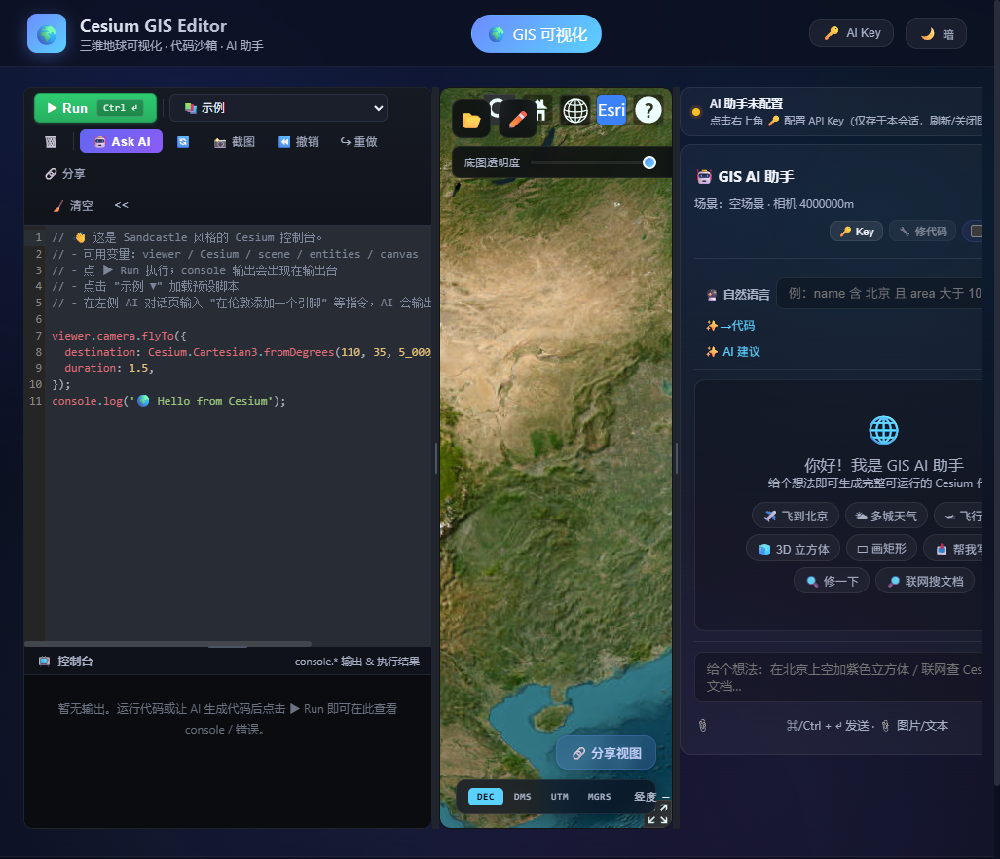

# 🌍 Cesium GIS Editor

独立开源的 GIS 可视化编辑器 — 三维地球 · 代码沙箱 · AI 助手



> 一个把**代码沙箱** + **矢量编辑** + **多平台 AI 助手**装进同一个工具的开源项目。
> 沿袭 Cesium Sandcastle 的思路：写代码、看地球、问 AI，浏览器即开即用，无需安装任何桌面软件。
> AI API Key 只存于浏览器内存，不落地、不落盘。

基于 React 18 + Vite 5 + CesiumJS 1.113 + Express 4 构建，支持代码驱动的三维地球场景编辑、矢量数据加载 / 绘制 / 编辑 / 分析、AI 辅助空间分析。

## ✨ 功能

### 🌐 三维地球

- CesiumJS 渲染，支持 **OSM / Esri / 天地图 / 高德** 等多种底图
- 默认加载 OpenStreetMap 公开底图，不配置任何 Token 也能用
- 坐标读数栏支持 **十进制度 / DMS / UTM / MGRS** 四种格式切换

### 💻 代码沙箱

- CodeMirror 6 编辑器 + 安全执行环境，像 Cesium Sandcastle 一样写代码控制地球
- 内置多个可直接运行的示例（相机飞行、引脚标注、空间标注等），带期望断言校验
- 代码执行错误一键「🔧 让 AI 修代码」

### ✏️ 矢量编辑器

- 点 / 线 / 面 / 矩形 / 圆绘制，支持顶点吸附、自动模式
- 顶点编辑、Undo/Redo 历史栈
- 样式面板（颜色、线宽、填充、透明度）
- 图层树 + 属性表（含字段 schema、分类统计）
- 测量工具（距离 / 面积）
- 属性查询构建器（多条件组合过滤）
- 几何简化（Simplify）
- 三项检查面板（位置 / 几何 / 属性 质量体检）
- 打印导出：**PNG / PDF / GeoJSON / KML / CSV / Shapefile**（.shp/.shx/.dbf/.prj zip 自实现）

### 📦 数据加载

GeoJSON / Shapefile（.shp/.zip）/ KML / CZML / glTF / GLB / CSV / XLSX 拖拽导入，表格文件自动识别经纬度列，加载即入图层树。

### 🧮 空间运算

服务端基于 Turf.js，提供 **buffer / intersect / difference / union / dissolve / centroid / convexHull** 七种运算，重型计算不阻塞前端，AI agent 可直接调用。

### 🤖 AI 助手

多平台大模型统一代理，SSE 流式输出，支持工具调用的 agentic loop：

| 平台 | 代表模型 |
|------|---------|
| OpenAI | GPT-4o / GPT-4o-mini |
| Anthropic | Claude |
| Google | Gemini |
| DeepSeek | DeepSeek-V3 / R1 |
| 通义千问 | Qwen |
| 智谱 | GLM |
| Moonshot | Kimi |
| MiniMax | MiniMax-M3 |
| Ollama | 本地部署模型 |

- **读工具**（只读查询场景）：`list_layers` / `describe_layer` / `query_features` / `get_selection` / `list_files`
- **写工具**（修改场景，执行前弹出用户确认）：`draw_feature` / `delete_features` / `set_attr` / `move_features` / `create_layer` / `fly_to` / `select_features`
- 支持文本 / 图片附件上传，自动注入当前场景上下文（图层、要素、相机状态）
- 每次对话实时显示 **Token 用量与费用**（按各家公开价目实时核算）
- API Key **仅存于浏览器内存**，刷新标签即清除，后端不落盘

### 🔗 视图分享与导出

- 把当前地图视角 + 场景打包成 URL 分享，附带 AI 生成的场景说明
- 一键截图当前地球画面

### 🎨 主题

默认暗色主题，支持一键切换。

## 🚀 快速开始

### 前置要求

- Node.js >= 18
- npm

### 安装

```bash
# 克隆仓库
git clone https://github.com/qoqpqpq/cesium-gis-editor.git
cd cesium-gis-editor

# 安装后端依赖
npm install

# 安装前端依赖
cd client && npm install && cd ..

# （可选）配置环境变量
cp .env.example .env
# 编辑 .env 填入 Cesium Ion Token / 天地图 Token（不填也能用）
```

### 开发模式

```bash
# 终端 1：启动后端（端口 3001）
npm run dev

# 终端 2：启动前端 dev server（端口 8080）
npm run client:dev
```

浏览器打开 http://localhost:8080

### 生产构建

```bash
# 构建前端 + 启动服务
npm run build
npm start
```

打开 http://localhost:3001

## 🔑 AI Key 配置

AI 助手采用**纯会话 Key**模式：

1. 点击页面右上角 **🔑** 按钮
2. 选择 AI 平台（OpenAI / Claude / Gemini 等）
3. 输入你的 API Key（可选自定义 Base URL 和模型名）
4. Key **仅存于浏览器内存**，刷新/关闭标签即清除，绝不落盘

后端只做转发代理（绕过浏览器 CORS），不存储任何 Key。

## 🗺️ 底图 Token（可选）

不配置任何 Token 也能用——默认加载 OpenStreetMap 公开底图。

如需更高画质底图：

- **Cesium Ion**：在 [.env](.env) 填 `CESIUM_ION_TOKEN`（申请：https://ion.cesium.com/tokens）
- **天地图**：在 [.env](.env) 填 `TIANDITU_TOKEN`（申请：https://console.tianditu.gov.cn/）

生产环境 Token 走服务端代理下发，浏览器不直接接触凭证。

## 🛠️ 技术栈

| 层级 | 技术 |
|------|------|
| 前端 | React 18 · Vite 5 · CesiumJS 1.113 · CodeMirror 6 · react-router-dom |
| 数据格式 | GeoJSON · Shapefile · KML · CZML · glTF/GLB · CSV · XLSX（jszip / xlsx 解析） |
| 后端 | Node.js · Express 4 · Turf.js 7 · node-fetch |
| 安全 | Helmet + CSP · express-rate-limit · 并发控制 · 无 sourcemap |
| 数据 | 无数据库，纯会话模式 |
| 部署 | 单 Node.js 进程，Node >= 18 |

## 🏗️ 架构

```
client/                # React + Vite 前端
  src/pages/gis/        # GIS 页面（三列布局：代码编辑器 | Cesium 地球 | AI 助手）
    editor/             # 矢量编辑器（绘制/编辑/样式/查询/测量/简化/导出）
      components/       # 分析面板 / 属性表 / 图层树 / 查询构建器 / 打印导出 / 三项检查
      hooks/            # 绘制 / 测量 / 选择 / 撤销 / 顶点编辑 / 简化
      utils/            # 导入导出 / 命令 / 坐标 / 吸附 / 自动模式 / AI 代码建议
    aiAgent.js          # agentic loop（工具调用 + SSE 流式对话）
    aiTools.js          # AI 读/写工具注册表（含用户确认机制）
    sandbox.js          # 代码沙箱安全执行环境
    CesiumEarth.jsx     # Cesium 地球视图
    CodeEditor.jsx      # CodeMirror 代码编辑器
    FileLoader.jsx      # 数据文件拖拽导入
    AiSidePanel.jsx     # AI 对话侧栏
  src/components/       # 共享组件（ErrorBoundary / ThemeProvider / AiKeySettings）
  src/api/              # API 层（aiApi / gisApi / spatialApi）
  src/utils/            # 会话 Key / 视图状态
server/                # 精简 Express 后端
  routes/              # ai.js（代理+工具解析）/ gis.js（Token 下发）/ spatial.js（Turf 运算）
  services/            # ai.js（多平台转发）/ spatial.js / ai-prompts.js
  middleware/          # 限流 + 并发控制
  agent/protocol/      # AI 工具协议（解析/格式化）
  utils/redact.js      # 错误信息密钥脱敏
```

## 🔒 安全设计

- **无数据库**：不存储任何用户数据或 API Key
- **Key 纯会话**：API Key 存浏览器内存，刷新即清，后端不落盘
- **Token 代理**：Cesium/天地图 Token 从服务端 `.env` 读取，按域名白名单下发
- **无 sourcemap**：构建产物不含 `.map` 文件，避免源码泄露
- **CSP**：生产环境启用 Content-Security-Policy，白名单 Cesium/底图/AI 域名
- **限流**：API / AI / 空间运算分级限流，防止配额烧光
- **脱敏**：错误响应统一过滤密钥与敏感信息

## 📝 License

[MIT](LICENSE) — 可自由使用、修改、分发。
